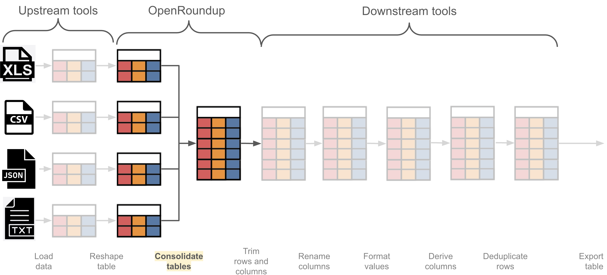

# Conceptual guide

This section contains conceptual guides that provide high-level overviews of key concepts and principles in OpenRoundup. These guides are designed to help you understand the underlying ideas and approaches that inform the design and functionality of OpenRoundup, and to provide a foundation for using OpenRoundup effectively. OpenRoundup makes the follow three key principles:

- **_Eager table consolidation_ workflow**: The step of integrating multiple tables together is performed early in the overall data wrangling workflow and further data wrangling tasks are performed downstream.
- **_Snowball approach_ to combining tables together**: A single consolidated tables is assembed via incrementally adding additional tables through two operations: _stacking_ and _packing_.

## OpenRoundup works within an _eager table consolidation_ workflows

We envision OpenRoundup being one of many tools used within an _[eager table consolidation](../references/glossary/#eager-table-consolidation)_ workflows: where users perform the step(s) of combining multiple tables together relatively early in the overall data wrangling workflow, performing further data wrangling tasks downstream.

The advantage of this approach, as opposed to a [_delayed table consolidation_](../references/glossary/#delayed-table-consolidation) approach, is that it allows users to have a complete, unified dataset available for analysis early in the data wrangling process. This can be particularly useful for workflows that involve a large number of tables, where it may be more efficient to perform data cleaning and transformation tasks on a single consolidated table rather than on multiple individual tables.

OpenRoundup expect a few tasks to be performed upstream, prior to importing data:

- **Data loading**: OpenRoundup does not support the extraction of data from unstructured sources, such as PDFs, websites, and APIs. We expect users to perform this step using external tools before importing data into OpenRoundup. OpenRoundup also expects that the first row of a table is the column header row, and that the column names are unique within a table.
- **Data shaping**: OpenRoundup does not _currently_ support the diverse ways of shaping data within a table, such as converting to [Tidy format](https://vita.had.co.nz/papers/tidy-data.pdf) or aggregating a single table. We expect users to perform this step using external tools before importing data into OpenRoundup.

	<strong>🗒️ Note on <a href="../references/glossary/#trimming">data trimming</a></strong> 
	OpenRoundup works best when source tables have been trimmed of irrelevant columns or rows. While OpenRoundup does support limited deletion of rows and columns, it is advantageous to remove batches of irrelevant rows and columns using upstream tools such as <a href="https://www.microsoft.com/en-us/microsoft-365/excel">Microsoft Excel</a> or <a href="https://www.google.com/sheets/about/">Google Sheets</a> before importing data into OpenRoundup.

Through these upstream tasks, users can ensure that their data is in a format that is compatible and optimized to work in OpenRoundup. Through these upstream tasks, we expects that the user has also developed some familiarity with the semantics and structure of the tables they wish to work with.

## OpenRoundup supports a _snowball approach_ to composite table assembly

OpenRoundup supports a _snowball approach_ to [composite table](../reference/glossery/#composite-table) assembly. Users begin by combining two tables together using either a _stack_ or _pack_ operation, and then iteratively combine the resulting composite table with additional tables through subsequent stack and pack operations until all tables have been combined. Through this process, users can build up a single consolidated table that combines data from many source tables.

### _Stacking_ tables

TODO

### _Packing_ tables

TODO
