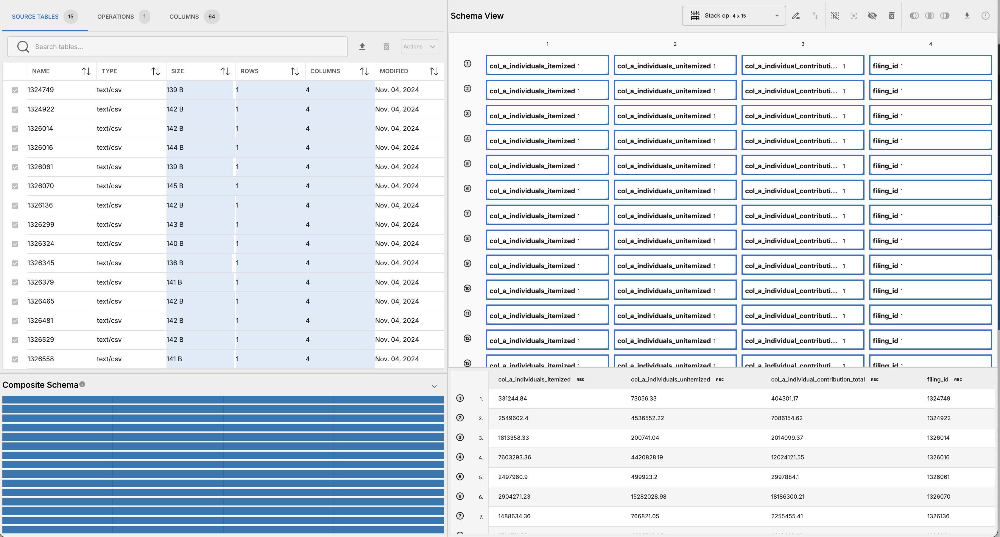

# Analysis of Early 2020 Democratic Campaign Co-Donors

## Overview

This workflow analyzes donors who gave more than $200 to multiple Democratic presidential candidates in the first quarter of the 2020 election cycle. The data comes from Federal Election Commission (FEC) campaign filings and was used to support the April 16, 2019 BuzzFeed News article ["These Are The Donors Giving Money To Multiple 2020 Democratic Candidates"](https://www.buzzfeednews.com/article/tariniparti/democratic-donors-2020-candidates).

## Data Sources

All data comes from campaigns' committee filings to the [Federal Election Commission](https://www.fec.gov/) (FEC), with assistance from [ProPublica's Campaign Finance API](https://projects.propublica.org/api-docs/campaign-finance/committees/#get-committee-filings).

- `inputs/candidates.csv` — a list of high- and medium-profile Democratic presidential candidates (and primary campaign committees) for whom an "April Quarterly" filing was available on the FEC's website by 6:30am Eastern on April 16, 2019.
- `inputs/filings.csv` — basic metadata for the aforementioned filings.
- `inputs/filings/` — raw filing data for each filing in the FEC's `.fec` format (converted to CSV for use in Roundup).

## Workflow Steps

### Pre-processing

1. Convert the 15 individual FEC filing files from `.fec` format to `.csv` format (one file per filing, named by filing ID, e.g. `1326465.csv`).

### Roundup Steps

1. Upload all 15 individual filings CSV files (e.g. `1326*.csv`), `filings.csv`, and `candidates.csv` into Roundup.
2. Create a _stack_ operation combining all 15 individual filings tables into a single table named `filings`.
   
3. Pack the `filings` table to the stack operation joining on the `filing_id` column in both tables.
4. 
5. Materialize the first pack operation and inspect results — confirm that row counts and column schemas are consistent across all source tables.
   
6. Pack the result of the first pack operation to the `candidates` table, joining on the `committee_id` column in both tables.
   
7. Materialize the second pack operation and inspect results — confirm that row counts and column schemas are consistent across all source tables.
8. Export the materialized result as a CSV for downstream analysis.
