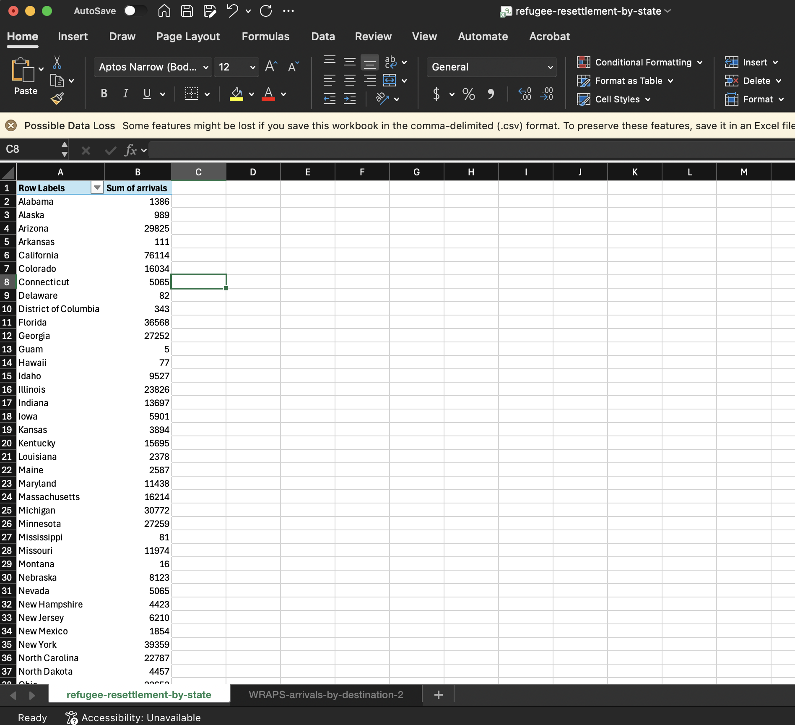
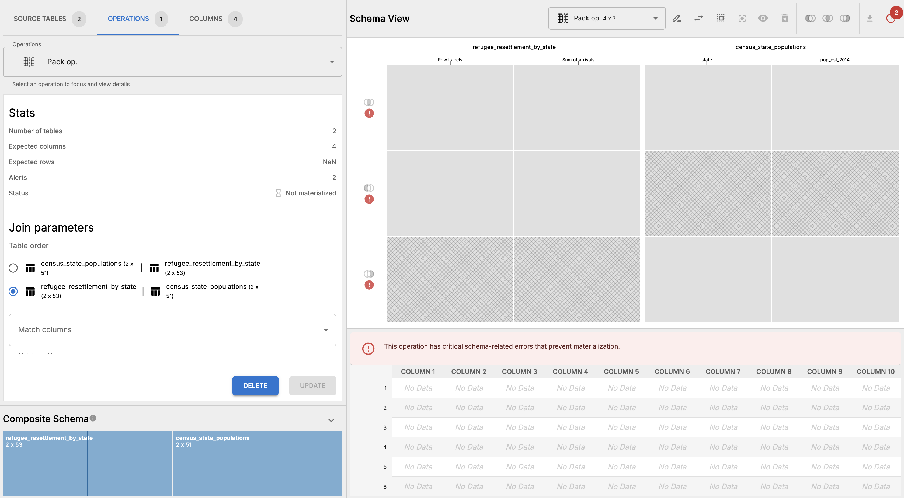
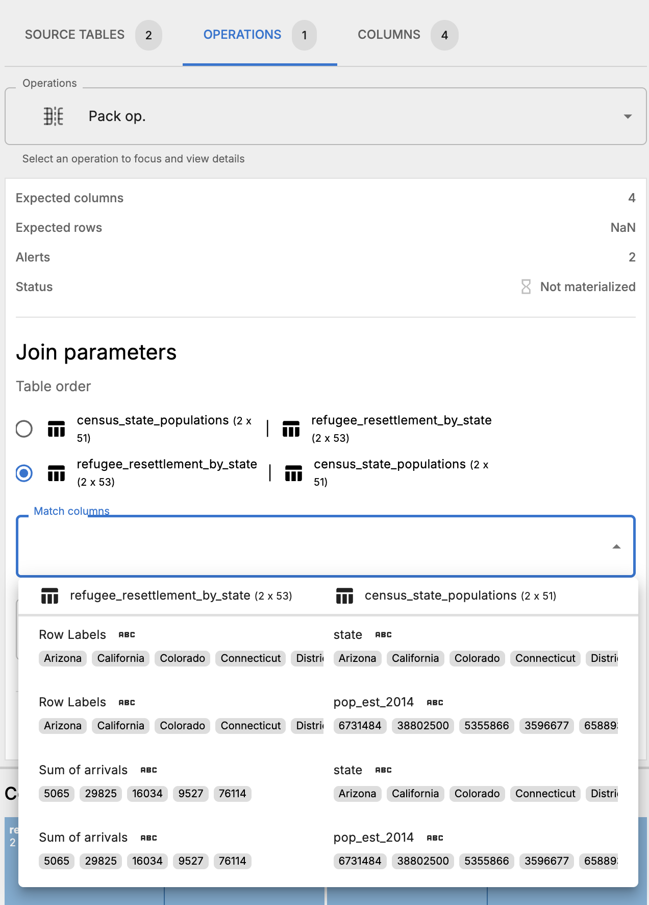
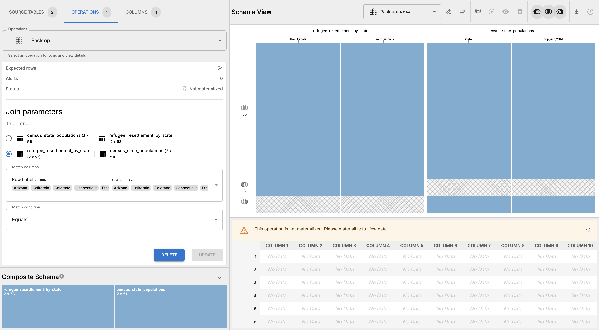
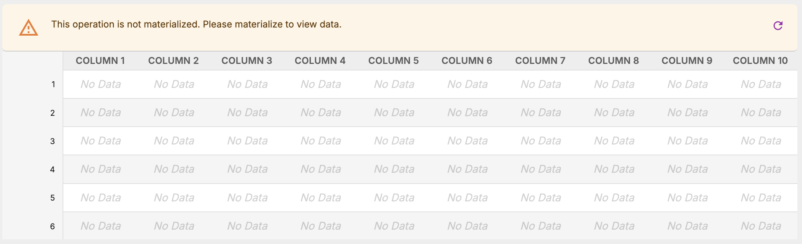
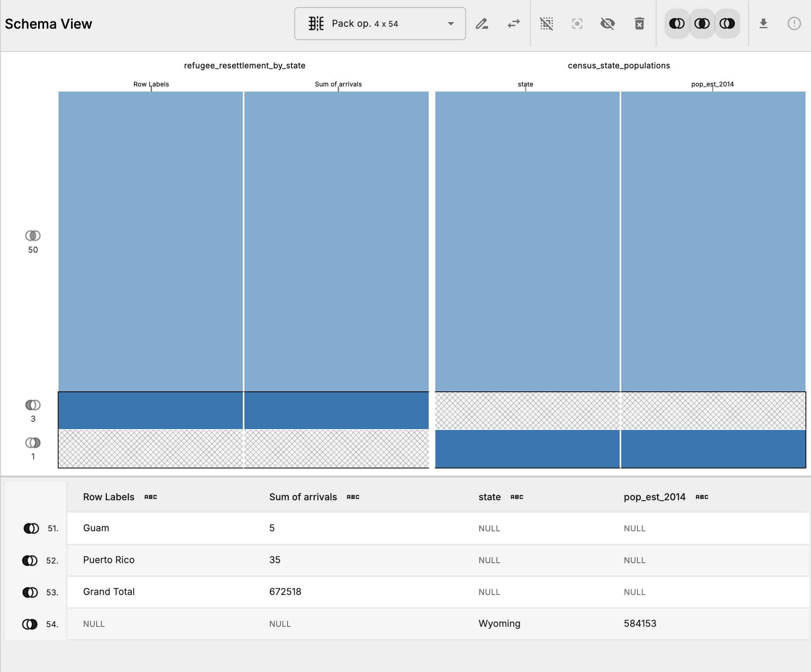
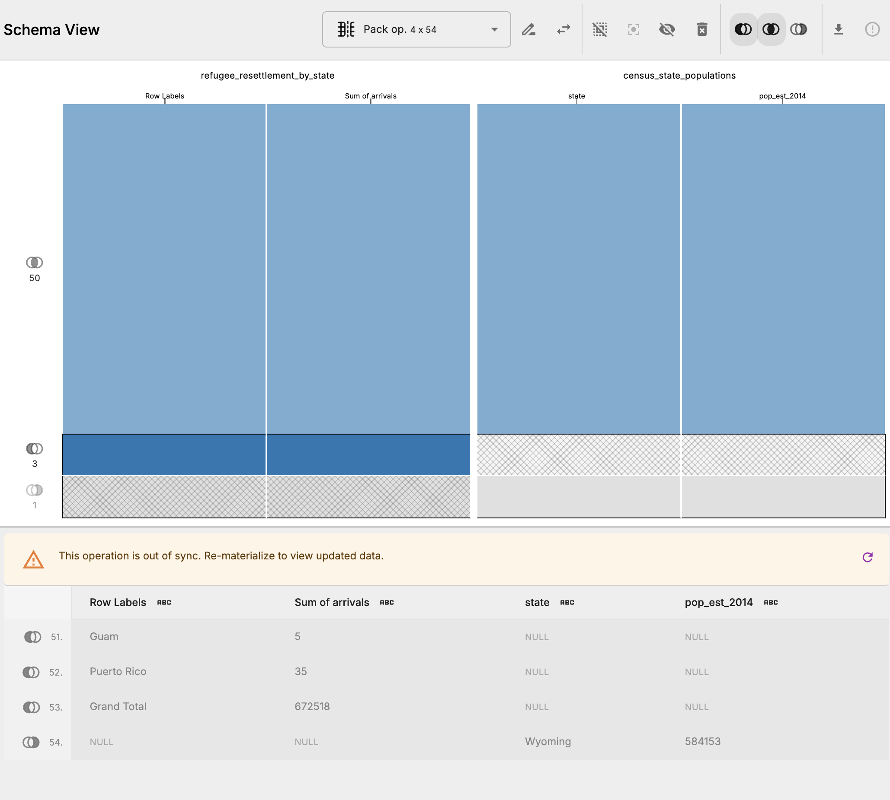
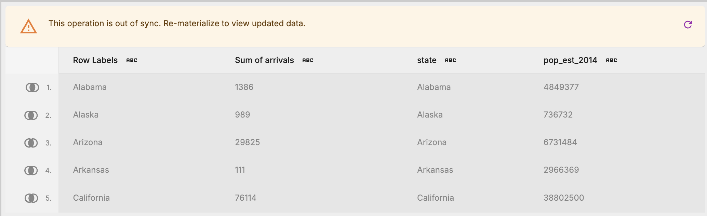
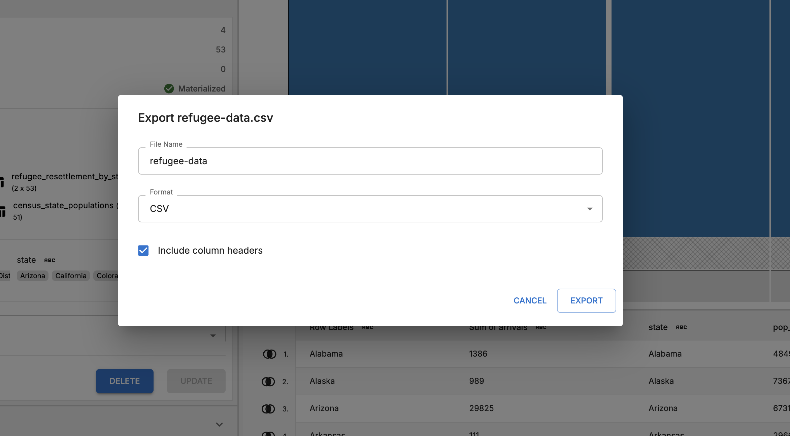

# Analysis of U.S. Refugee Data

## Overview

This workflow analyzes U.S. refugee resettlement data by state, combining a table of refugee arrivals by destination with a table of U.S. Census state population estimates to calculate per-capita refugee resettlement rates by state. The analysis supported the November 19, 2015 BuzzFeed News article ["Where U.S. Refugees Come From — And Go — In Charts"](http://www.buzzfeed.com/jsvine/where-us-refugees-come-from-and-go-in-charts).

## Data Sources

Refugee arrival data comes from the [Department of State's Refugee Processing Center](https://www.wrapsnet.org/)'s [data portal](http://www.wrapsnet.org/Reports/InteractiveReporting/tabid/393/Default.aspx), specifically the "Arrivals by Destination and Nationality" report generated on November 18, 2015. The raw data file is `WRAPS-arrivals-by-destination-2005-2015.csv`.

State population data comes from the [U.S. Census Bureau's 2014 state population estimates](http://www.census.gov/popest/data/state/asrh/2014/index.html), provided as `census-state-populations.csv`.

## Workflow Steps

### Pre-processing

Because OpenRoundup does not current support aggregating tables, we need to perform a pre-processing step to aggregate the refugee resettlement data by state before importing it into Roundup. This can be done in Excel or Google Sheets. We have provided the pre-processed file `refugee-resettlement-by-state.csv` in the provided `2015-11-refugees-in-the-united-states.zip` file, but you can also follow these steps to reproduce it:

1. Open `data/WRAPS-arrivals-by-destination-2005-2015.csv` in Excel or Google Sheets.
2. Remove the first three rows of metadata
3. Create a pivot table aggregating destination state and summing the total number of arrivals. 
4. Export the pivot table as `refugee-resettlement-by-state.csv`.

### Roundup steps

1. Import `census-state-populations.csv` and `refugee-resettlement-by-state.csv` into OpenRoundup.
2. Rename tables (optional) `census-state-populations.csv` to `state-populations` and `refugee-resettlement-by-state.csv` to `refugee-resettlement`.
3. _Pack_ `state-populations` and `refugee-resettlement` tables together. 
4. Specify which columns to join these tables upon by selecting a column main for the "Match columns" select in the Join parameters form. In this case, we want to select "Row Lables" from the `refugee_resettlement_by_state` table and `state` from `censsu_state_populations` table. 
5. Keep the "Match condition" as "Equals" and click the update button to preview the resulting schema. In the schema pane, we can see that there are 50 rows that match, 3 rows in `refugee-resettlement` that don't have a match in `state-populations`, and 1 row in `state-populations` that doesn't have a match in `refugee-resettlement`. 
6. Materialize the pack operation by clicking the circle arrow icon. 
7. Inspect the non-matching rows by shift-clicking on the venn diagram labels for the unmatched portion of the schema. We can see that the unmatched row in `state-populations` is Wyoming, and the unmatched rows in `refugee-resettlement` are Puerto Rico, Grand Total, and Guam. That Wyoming is not present in the `refugee-resettlement` data is a detail that was initiall missed in the original workflow and a correction was ultimately issued after publication to address this problem. 
8. Update the match selection by toggling only the portions of the pack operation that we're interested in keeping: matches and left-only rows (Wyoming). This effectively removing the Puetro Rico, Grand Total, and Guam rows from the resulting table. 
9. Materialize the pack operation again because we have modified the schema and now the schema and the table are out of sync. 
10. Export the materialized table and rename the file as needed. 

### Post Roundup steps

After exporting the materialized table, you can perform additional cleaning and analysis in Excel or Google Sheets, including modifying strings, changing column types, etc. You can also create visualizations such as bar charts or maps to illustrate the findings.
