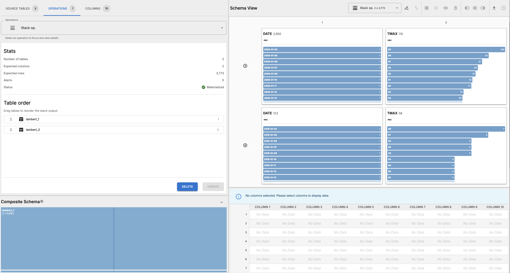
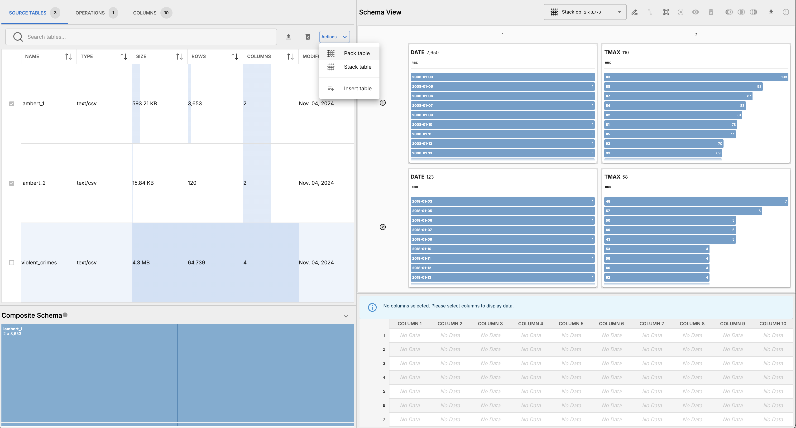
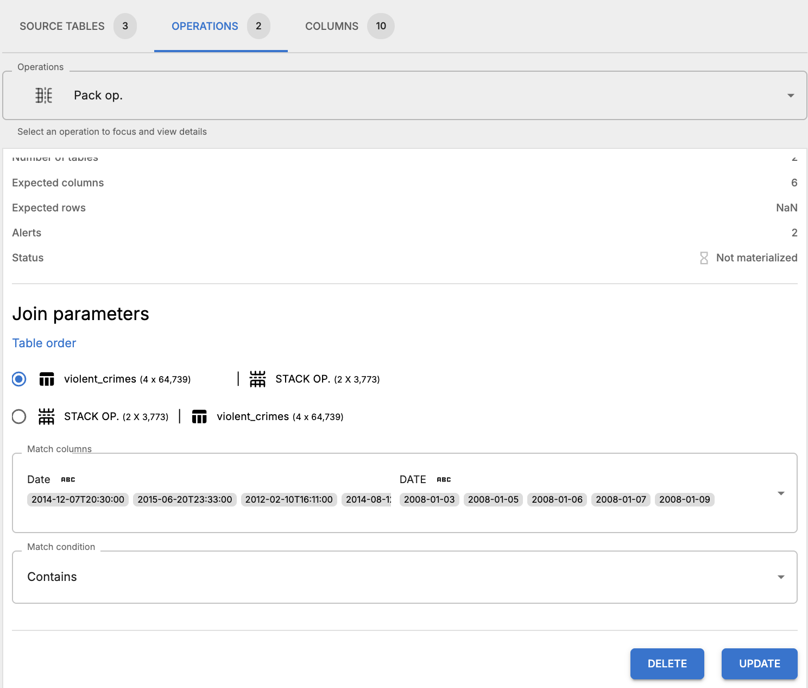
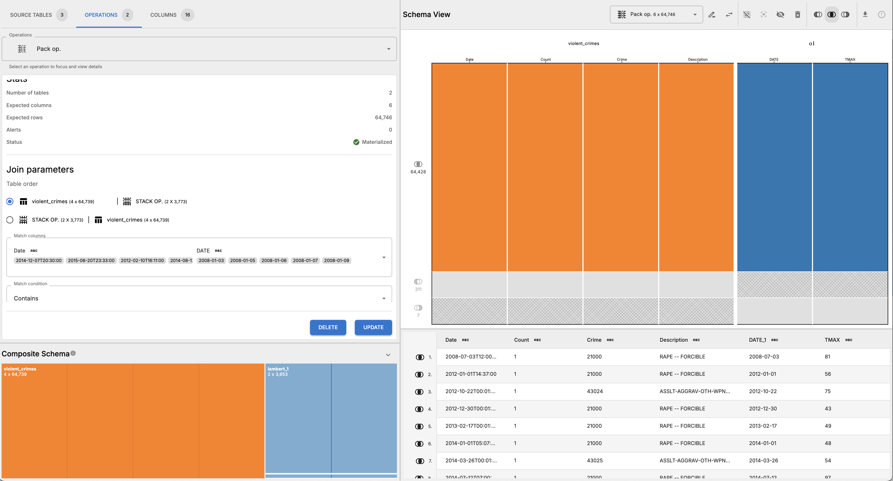

# Crime and Heat Analysis

## Overview

This workflow analyzes the relationship between crime and heat in St. Louis, Missouri, by joining a table of violent crime incidents with tables of daily maximum temperatures. The analysis supported the May 31, 2018, St. Louis Public Radio story [Warm weather worries in St. Louis: When temperatures rise, crime often follows](http://news.stlpublicradio.org/post/warm-weather-worries-st-louis-when-temperatures-rise-crime-often-follows).

## Data Sources

Temperature data comes from NOAA temperature data for the St. Louis Lambert International Airport weather station (USW00013994). The data is split across two files — `lambert_1.csv` and `lambert_2.csv`, each containing daily observations including maximum temperature (`TMAX`) and precipitation.

Violent crime incident data is provided in `violent_crimes.csv`, sourced from the St. Louis Metropolitan Police Department. Each row represents an individual violent crime incident with a date, crime type code, and description.

## Workflow Steps

### Pre-processing

There are no pre-processing steps in this workflow. The source tables can be directly imported into Roundup.

### Roundup steps

These steps outline just one of many possible ways to wrangle the source tables into the final form.

1. Load the following source tables: `lambert_1.csv`, `lambert_2.csv`, and `violent_crimes.csv`.
2. Create a _stack_ operation from `lambert_1.csv` and `lambert_2.csv`.
   
3. Rename Stack operation to `lambert`.
4. Re-arrange columns in `lambert` so that `DATE` and `TMAX` are the first two columns.
5. Trim extra columns to align tables, leaving only `DATE` and `TMAX`.
6. Materialize `lambert` and inspect results
   
7. Create a _pack_ operation from the previous stack operation, and `violent_crimes.csv`.
   
8. Update _pack_ parameters so that `DATE` to match `Date` and set the join predicate to `CONTAINS`, and swap table order so `violent_crimes` is the left-hand table and `lambert` is the right-hand table.
   
9. Materialize pack operation and inspect results
10. Remove any rows that don't match in both tables, which will remove any crime incidents that don't have a corresponding temperature reading and any temperature readings that don't have a corresponding crime incident. Materialize again and inspect results.
    
11. Export pack operation results as a CSV and save it in the `output` directory. This table can be used to analyze the relationship between crime and heat, which was the main analysis for the original story.

### Post Roundup steps

After exporting the final table from Roundup, the user can aggregate these rows, which represent individual instances of violent crime, by date, to get the number of violent crimes per date with the maximum temperature on that date.
