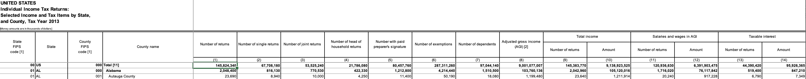
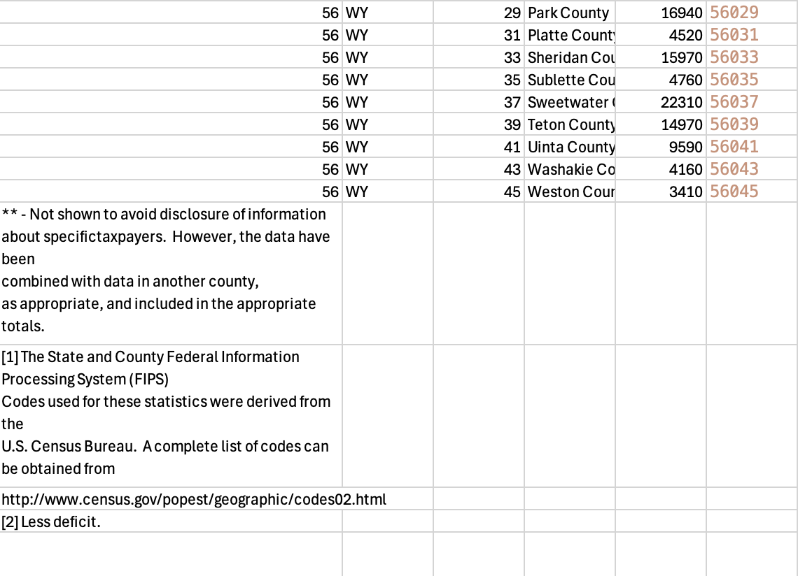
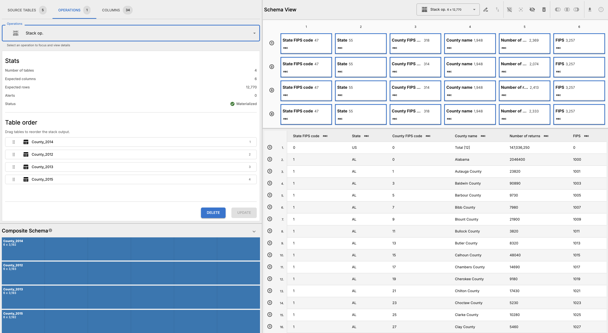
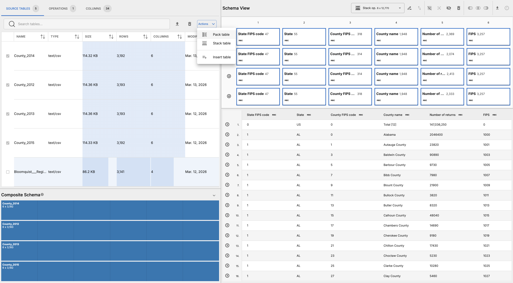
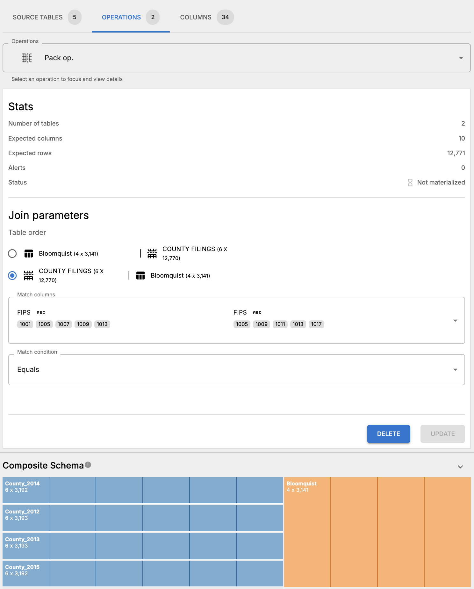
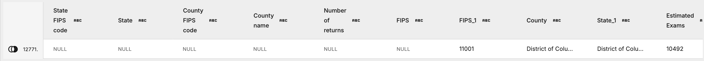
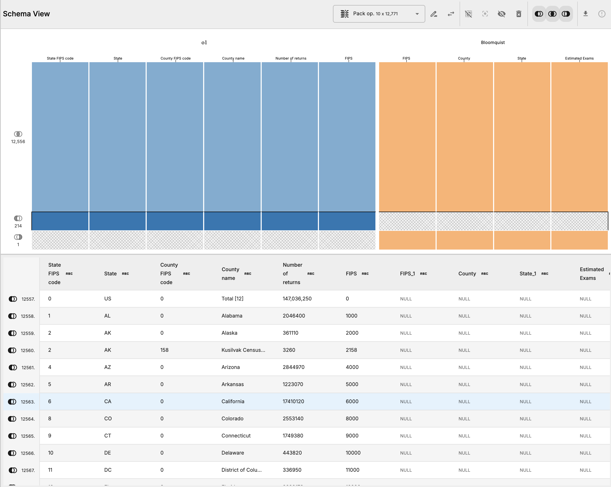
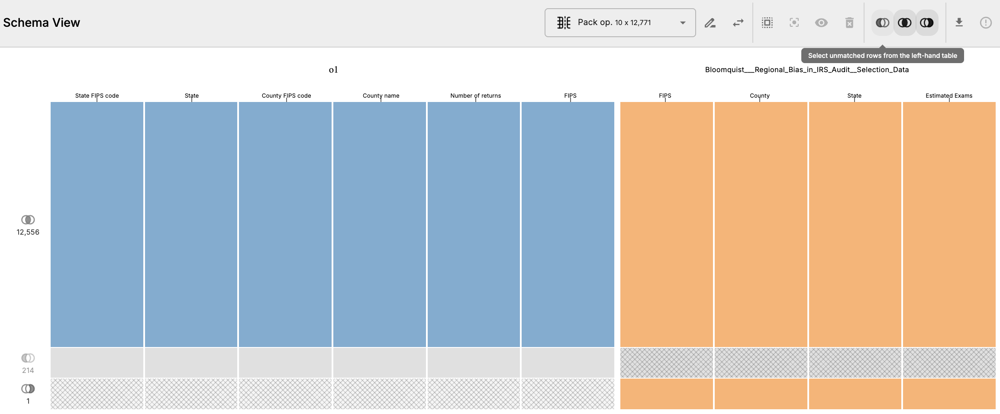

# IRS Audit Rates by County

## Overview

This workflow processes data backing ProPublica's April 1, 2019 investigation ["Where in The U.S. Are You Most Likely to Be Audited by the IRS?"](https://projects.propublica.org/graphics/eitc-audit). The analysis maps the distribution of IRS audits across U.S. counties, revealing that the audit rate in each county largely reflects how many taxpayers claimed the Earned Income Tax Credit (EITC).

## Data Sources

- `Bloomquist - Regional Bias in IRS Audit Selection Data.xlsx` — estimated number of tax exams (audits) per county for tax years 2012–15, calculated by Kim M. Bloomquist using audit coverage rates from the annual IRS Data Book.
- `County-2012.xlsx`, `County-2013.xlsx`, `County-2014.xlsx`, `County-2015.xlsx` — number of tax filings per county for each year, downloaded from the [IRS website](https://www.irs.gov/statistics/soi-tax-stats-county-data).

## Workflow Steps

### Pre-processing

Roundup performs best when a user does some pre-processing prior to importing data into OpenRoundup, and this workflow is illustrative of many common data tasks we perform in external tools before loading data into Roundup, including:

- Flattening nested headers
- Removing data notes at the end of tables
- Creating combined key columns to join on
- Removing many, many irrelevant columns (more than 100 in each table)

_We have already performed these pre-processing steps in the downloadable data package, but they can be performed manually before loading data into Roundup._

For each of the four county filings spreadsheets (`County-2012.xlsx` through `County-2015.xlsx`):

1. Open in a spreadsheet application, e.g. Microsoft Excel or Google Sheets.
2. These files have nested headers; flatten them so that all column names appear in a single header row.
   
3. These spreadsheets also are inundated with irrelevant columns. Remove all irrelevant columns. For the sake of simplicity, the supplied data retains only the first five columns in each spreadsheet. Some spreadsheets have 256 columns, so this is a significant reduction in data that we know we won't be using for our analysis. This step is not strictly necessary, but it makes it easier to work with the data in Roundup and reduces the likelihood of running into performance issues.
4. Remove any data notes at the end of the table, which are not part of the data. For this particular workflow, it is not strictly necessary to do this, these rows can be removed via _pack_ operation parameters, but we will demonstrate this feature with other rows in the data. 
5. In each spreadsheet, create a combined FIPS code column by concatenating the state FIPS code with the county FIPS code to create a unique county identifier. This can be done by concatenating the state FIPS code with a zero-padded version of the county FIPS code, e.g. `=CONCAT(A2, TEXT(C2, "000"))` in Excel. Pro tip: You can also apply a formula to the entire column by double clicking the bottom-right corner of a cell.
6. Export as a CSV.

For the Bloomquist audit data spreadsheet, simply open it in a spreadsheet application and export it to CSV, as no pre-processing is necessary for that table.

### Roundup Steps

One the pre-processing steps have been completed, the data can be imported into Roundup and further processed using _stack_ and _pack_ operations.

1. Import all the data into Roundup.
2. Rename the `Bloomquist__Regional_Bias_in_IRS_Audit_data` to just `Bloomquist` for easier reference in subsequent steps.
3. _Stack_ the four county filings tables together.
   
4. Materialize the stack operation and inspect results to confirm that the stack has been performed correctly. The resulting table should have the same columns as the source tables. .
5. Rename the stack operation to "county-filings" for easier reference in subsequent steps.
6. In the Source Tables tab, select Bloomquist table and click "pack table" in the actions dropdown button for the component. .
7. Create a _pack_ operation joining the stacked county filings to the Bloomquist audit data on the combined FIPS code column, using a left join.
8. Update the _pack_ operation parameters such that the match columns are "FIPS" in both tables and the match condition is EQUALS. 
9. Materialize the pack operation and inspect results. There's one row in the Bloomquist table that doesn't have a match in the county filings table. That row belongs to the District of Columbia, where in the Bloomquist table the FIPS code is `11001`. When we look through the county filings table, we see that the FIPS code for the District of Columbia is `11000`. This is a common issue when working with data from multiple sources — sometimes there are slight discrepancies, but Roundup can surface these issues to the user. In this case, we can fix this by updating the FIPS code in all the county filings tables. 
10. Likewise, there are more than 200 rows in the county filings table that don't have a match in the Bloomquist table. Clicking the left-margin label for this partition into the table selects all the columns in the tables at this location, which makes it easy to inspect the unmatched rows. In the table below, we can see that these unmatched FIPS codes are from state totals present in the county filings table .
11. Update the match selection and toggle off the left-only match group (left-shaded venn diagram) exclude these unmatched rows .
12. Rematerialize the pack operation. The resulting table will now exclude those rows.
13. Now we can export the final materialized table as a CSV. This table can be used to calculate the number of audits per capita by county, which was the main analysis for the original story.
