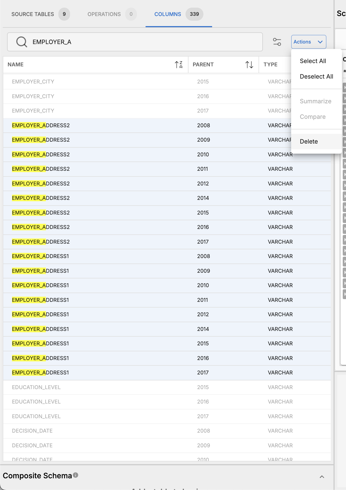
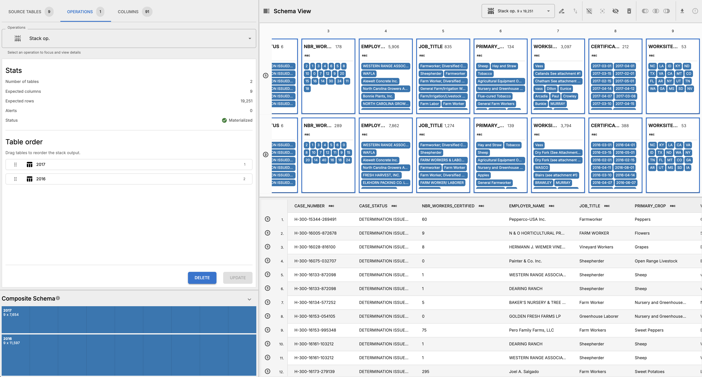
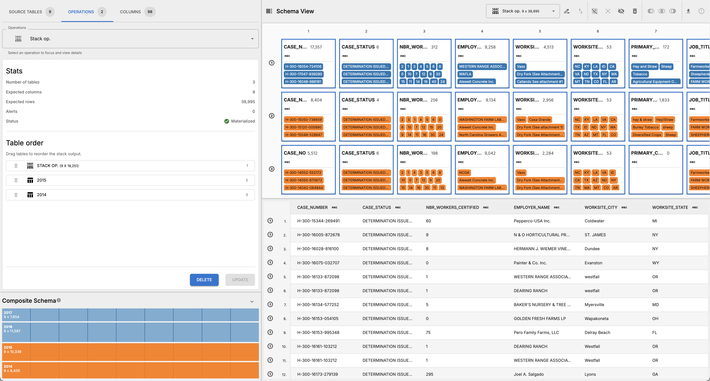
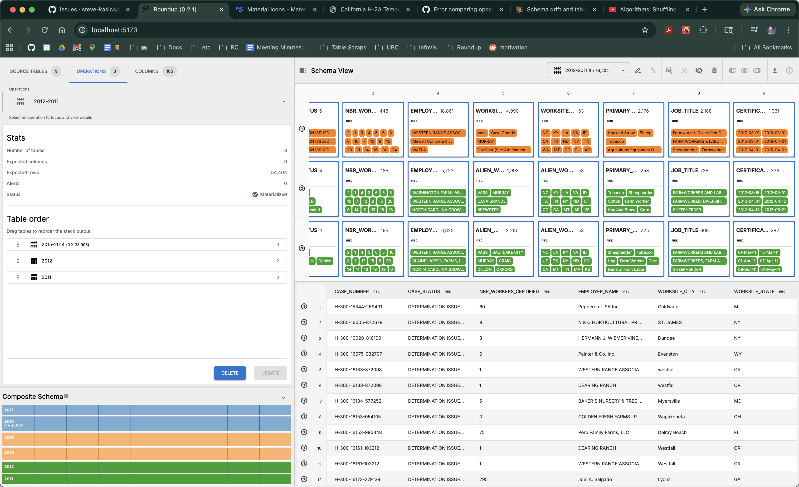
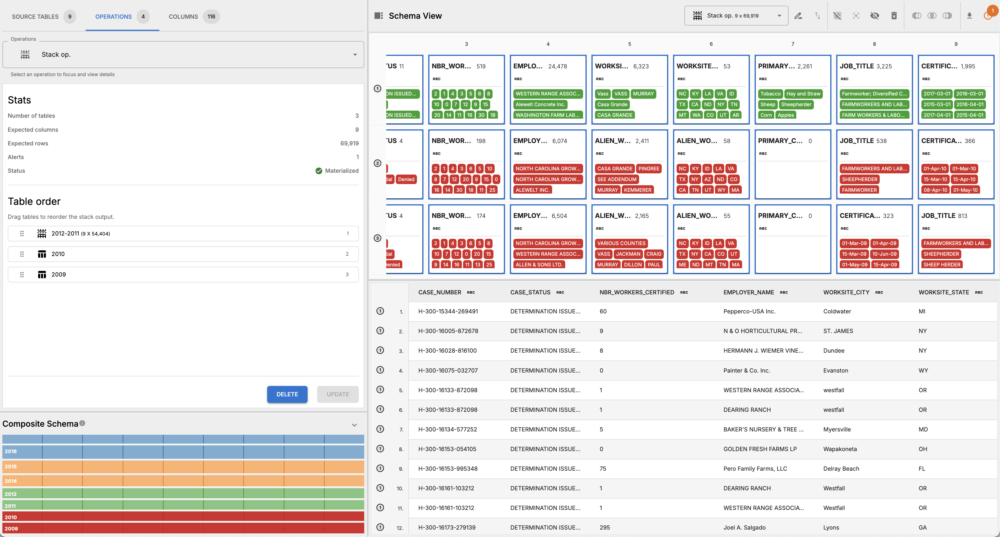
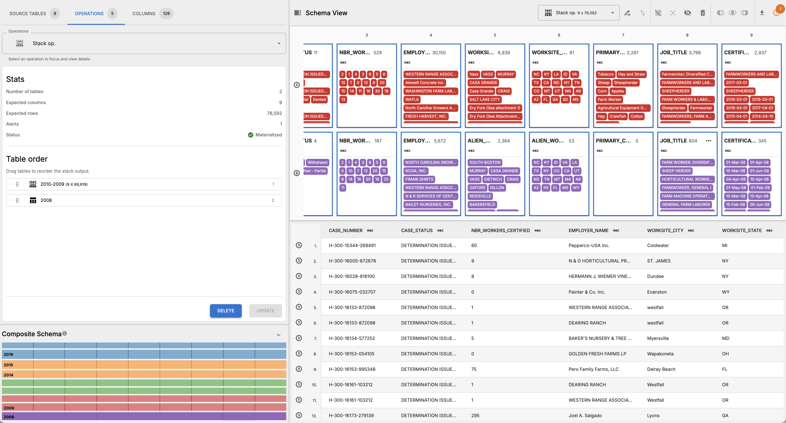

# California H-2A Temporary Agricultural Worker Visas Analysis

## Overview

This workflow analyzes data on temporary H-2A agricultural worker visas granted by the U.S. Department of Labor. The analysis supported the May 25, 2017 Los Angeles Times story ["To keep crops from rotting in the field, farmers say they need Trump to let in more temporary workers"](http://www.latimes.com/projects/la-fi-farm-labor-guestworkers/).

## Data Sources

Data comes from the U.S. Department of Labor's H-2A program records, provided as large XLSX files. Each file contains data for a single year, and the workflow stacks data from 10 years (2008-2017) to analyze trends over time. However, XLSX file for 2013 is corrupt and cannot be included in the workflow, so the analysis is based on 9 years of data.

## Workflow Steps

### Pre-processing

The original input data tables are in and XLSX format, which is not (yet) directly supported by OpenRoundup. The most straightforward way to convert these files into a format that can be imported into OpenRoundup is to open them in a spreadsheet application, such as Microsoft Excel or Google Sheets, and export them as CSV files. This is the approach taken in this workflow, but there are other ways to convert XLSX files to CSV files. Do this process for XLSX source files from 2008 to 2017, e.g. `2008.xlsx`. Note that the 2013 file is corrupt and cannot be opened, so it cannot be included in the workflow.

### OpenRoundup Steps

This is a stack-only workflow, and while the user can choose to _stack_ all the pre-processed CSVs together in a single operation, the workflow steps described here create a composite table of multiple stack operations. There is significant schema drift across the source files, so stacking them in smaller batches allows for easier inspection and handling of schema differences.

1. Import the `.csv` files from 2008-2017 into OpenRoundup.
2. Open the columns sidebar and sort columns by name.
3. Delete columns across tables that are not relevant to the analysis, such as those related to employer contact information. OpenRoundup can also be used to trim tables, although conceptually this is a precursory step. 

   Removing the following columns by name reduces the total number of columns in the workflow from 339 to 94 (decreasing the number of columns by approximately 72%):
   - `AGENT_*` (e.g. `AGENT_CITY`, `AGENT_STATE`, etc.)
   - `APPLICATION_TYPE`
   - `BASIC_*` (e.g. `BASIC_PAY_RATE_FROM`, `BASIC_PAY_RATE_TO`, etc.)
   - `CASE_RECEIVED_DATE`
   - `CERTIFICATION_END_DATE`
   - `DECISION_DATE`
   - `EMPLOYER_*` (excluding `EMPLOYER_NAME`)
   - `EMP_*` (e.g. `EMP_EXPERIENCE_REQD`)
   - `JOB_*` (excluding `JOB_TITLE`)
   - `L*` (e.g. `LAWFIRM_NAME`)
   - `M*` (e.g. `MAJOR`)
   - `NA*` (e.g. `NAICS_CODE`,)
   - `NBR_WORKERS_REQUESTED`
   - `O*` (e.g. `ORGANIZTION_FLAG`)
   - `REQUESTED_*` (e.g. `REQUESTED_START_DATE_OF_NEED`)
   - `S*` (e.g. `SOC_CODE`)
   - `T*` (e.g. `TRAINING_REQ`)
   - `V*` (e.g. `VISA_CLASS`)

4. _Stack_ tables `2017` and `2016` into a single stack operation.
   
5. Rearrange and delete columns until the schemas of the two tables match, including the following 9 columns only (order does not matter):
   - `CASE_NUMBER`
   - `CASE_STATUS`
   - `NBR_WORKERS_CERTIFIED`
   - `EMPLOYER_NAME`
   - `WORKSITE_CITY`
   - `WORKSITE_STATE`
   - `PRIMARY_CROP`
   - `JOB_TITLE`
   - `CERTIFICATION_BEGIN_DATE`
6. Materialize the first stack operation and inspect results. 
7. Repeat the stacking process for the remaining tables, I use the following groups:
   - Stack `2015` and `2014` 
   - Stack `2012` and `2011` (2013 is missing b/c the XLSX file is corrupt) 
   - Stack `2010` and `2009` 
   - Stack `2008` 
8. Finally export the results resulting in a 9 MB file that can be used for analysis.

## Appendix

### Schema Drift Across Source Tables

The main schematic differenes include: `CASE_NO` vs. `CASE_NUMBER`, `WORKSITE_LOCATION_CITY` vs. `WORKSITE_CITY` vs. `ALIEN_WORK_CITY`, `WORKSITE_LOCATION_STATE` vs. `WORKSITE_STATE` vs. `ALIEN_WORK_STATE`, and the appearance and disappearance of the `PRIMARY_CROP` column. The table below summarizes the schema differences across all tables for the 9 columns that are relevant to the analysis.

|          | **case_number** | **case_status** | **workers_certified**   | **employer**    | **city**                 | **state**                 | **crop**       | **job_title** | **certification_start_date** |
| -------- | --------------- | --------------- | ----------------------- | --------------- | ------------------------ | ------------------------- | -------------- | ------------- | ---------------------------- |
| **2017** | `CASE_NUMBER`   | `CASE_STATUS`   | `NBR_WORKERS_CERTIFIED` | `EMPLOYER_NAME` | `WORKSITE_CITY`          | `WORKSITE_STATE`          | `PRIMARY_CROP` | `JOB_TITLE`   | `CERTIFICATION_BEGIN_DATE`   |
| **2016** | `CASE_NUMBER`   | `CASE_STATUS`   | `NBR_WORKERS_CERTIFIED` | `EMPLOYER_NAME` | `WORKSITE_CITY`          | `WORKSITE_STATE`          | `PRIMARY_CROP` | `JOB_TITLE`   | `CERTIFICATION_BEGIN_DATE`   |
| **2015** | `CASE_NUMBER`   | `CASE_STATUS`   | `NBR_WORKERS_CERTIFIED` | `EMPLOYER_NAME` | `WORKSITE_CITY`          | `WORKSITE_STATE`          | `PRIMARY_CROP` | `JOB_TITLE`   | `CERTIFICATION_BEGIN_DATE`   |
| **2014** | `CASE_NO`       | `CASE_STATUS`   | `NBR_WORKERS_CERTIFIED` | `EMPLOYER_NAME` | `WORKSITE_LOCATION_CITY` | `WORKSITE_LOCATION_STATE` | NULL           | `JOB_TITLE`   | `CERTIFICATION_BEGIN_DATE`   |
| **2013** | `CASE_NO`       | `CASE_STATUS`   | `NBR_WORKERS_CERTIFIED` | `EMPLOYER_NAME` | `ALIEN_WORK_CITY`        | `ALIEN_WORK_STATE`        | NULL           | `JOB_TITLE`   | `CERTIFICATION_BEGIN_DATE`   |
| **2012** | `CASE_NO`       | `CASE_STATUS`   | `NBR_WORKERS_CERTIFIED` | `EMPLOYER_NAME` | `ALIEN_WORK_CITY`        | `ALIEN_WORK_STATE`        | `PRIMARY_CROP` | `JOB_TITLE`   | `CERTIFICATION_BEGIN_DATE`   |
| **2011** | `CASE_NO`       | `CASE_STATUS`   | `NBR_WORKERS_CERTIFIED` | `EMPLOYER_NAME` | `ALIEN_WORK_CITY`        | `ALIEN_WORK_STATE`        | `PRIMARY_CROP` | `JOB_TITLE`   | `CERTIFICATION_BEGIN_DATE`   |
| **2010** | `CASE_NO`       | `CASE_STATUS`   | `NBR_WORKERS_CERTIFIED` | `EMPLOYER_NAME` | `ALIEN_WORK_CITY`        | `ALIEN_WORK_STATE`        | null           | `JOB_TITLE`   | `CERTIFICATION_BEGIN_DATE`   |
| **2009** | `CASE_NO`       | `CASE_STATUS`   | `NBR_WORKERS_CERTIFIED` | `EMPLOYER_NAME` | `ALIEN_WORK_CITY`        | `ALIEN_WORK_STATE`        | null           | `JOB_TITLE`   | `CERTIFICATION_BEGIN_DATE`   |
| **2008** | `CASE_NO`       | `CASE_STATUS`   | `NBR_WORKERS_CERTIFIED` | `EMPLOYER_NAME` | `ALIEN_WORK_CITY`        | `ALIEN_WORK_STATE`        | null           | `JOB_TITLE`   | `CERTIFICATION_BEGIN_DATE`   |
