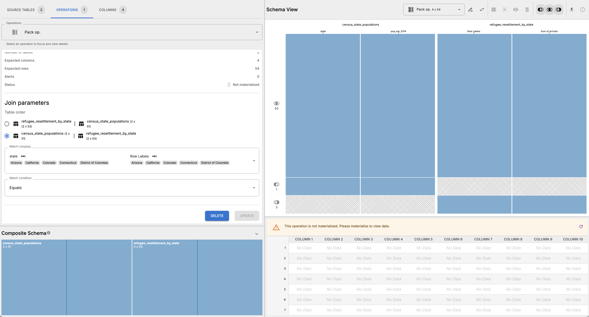
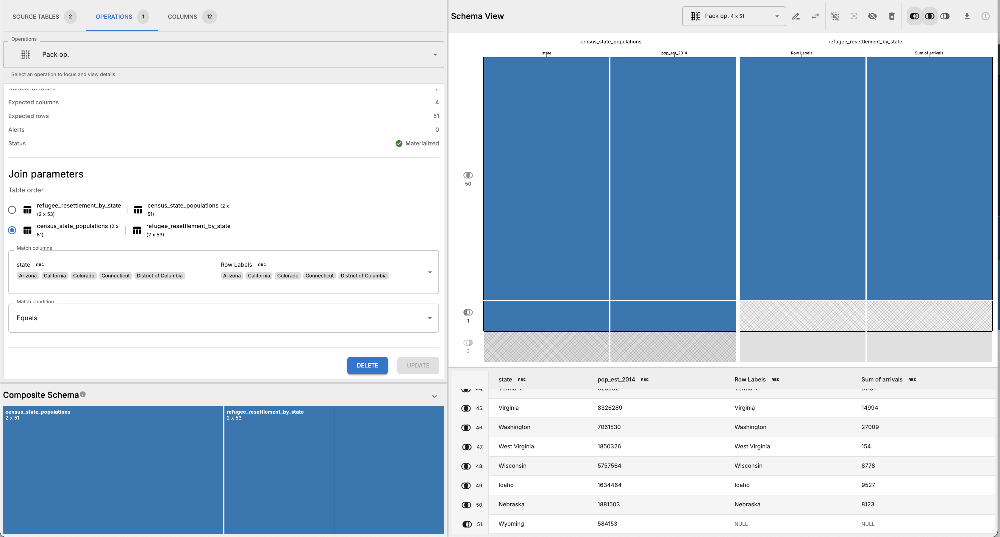

# Analysis of U.S. Refugee Data

## Overview

This workflow analyzes U.S. refugee resettlement data by state, joining a table of refugee arrivals by destination to a table of U.S. Census state population estimates to calculate per-capita refugee resettlement rates by state. The analysis supported the November 19, 2015 BuzzFeed News article ["Where U.S. Refugees Come From — And Go — In Charts"](http://www.buzzfeed.com/jsvine/where-us-refugees-come-from-and-go-in-charts).

## Author & Sources

- **Author:** Jeremy Singer-Vine
- **Publication:** BuzzFeed News
- **Published:** November 19, 2015
- **Original Article URL:** http://www.buzzfeed.com/jsvine/where-us-refugees-come-from-and-go-in-charts
- **GitHub Repository:** https://github.com/BuzzFeedNews/2015-11-refugees-in-the-united-states

## Data Sources

Refugee arrival data comes from the [Department of State's Refugee Processing Center](https://www.wrapsnet.org/)'s [data portal](http://www.wrapsnet.org/Reports/InteractiveReporting/tabid/393/Default.aspx), specifically the "Arrivals by Destination and Nationality" report generated on November 18, 2015. The raw data file is `WRAPS-arrivals-by-destination-2005-2015.csv`.

State population data comes from the [U.S. Census Bureau's 2014 state population estimates](http://www.census.gov/popest/data/state/asrh/2014/index.html), provided as `census-state-populations.csv`.

## Workflow Steps

The multi-table aspect of this workflow depends upon joining a table of state population estimates to a table of refugee resettelemnt by state.

### Pre-processing

1. Open `data/WRAPS-arrivals-by-destination-2005-2015.csv` in Excel or Google Sheets.
2. Remove the first three rows of metadata
3. Create a pivot table aggregating destination state and summing the total number of arrivals.
   
4. Export the pivot table as `refugee-resettlement-by-state.csv` and save it in the `data` directory.

### Roundup steps

1. Import `census-state-populations.csv` and `refugee-resettlement-by-state.csv` into Roundup.
2. Rename tables:
   - `census-state-populations.csv` to `state-populations`
   - `refugee-resettlement-by-state.csv` to `refugee-resettlement`
3. _Pack_ `state-populations` and `refugee-resettlement` tables together and set the schema to match on `state` and `Row Labels`, respectively.
   
4. Materialize the pack operation and inspect the results. There's 1 row in `state-populations` that doesn't have a match in `refugee-resettlement` (Wyoming), and 3 rows in `refugee-resettlement` that don't have a match in `state-populations` (Puerto Rico, Grand Total, and Guam).
5. Update pack params to only take rows that match in both tables or are in `state-populations` and materialize again. Inspect results to confirm that the 3 unmatched rows have been removed.
   - 
6. Export the materialize table as a CSV and save it in the `output` directory. This table can be used to calculate the number of refugees resettled per capita by state, which was the main analysis for the original story.

### Post Roundup steps

After exporting the materialized table, you can perform additional cleaning and analysis in Excel or Google Sheets, including modifying strings, changing column types, etc. You can also create visualizations such as bar charts or maps to illustrate the findings.
