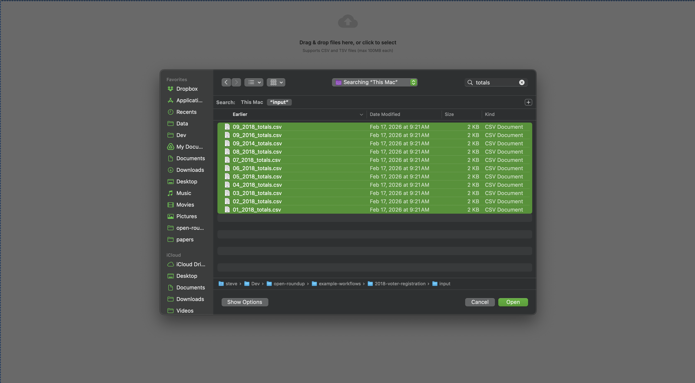
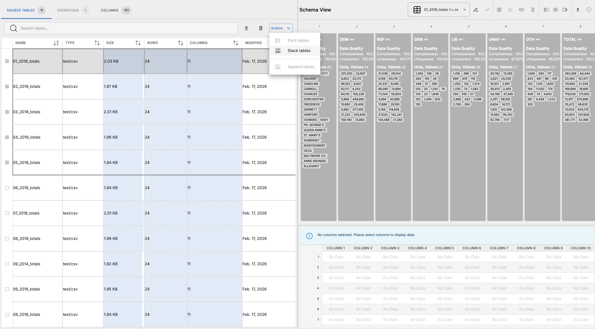
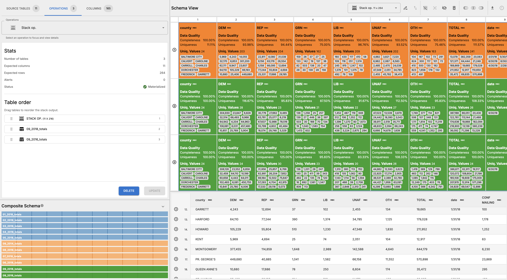
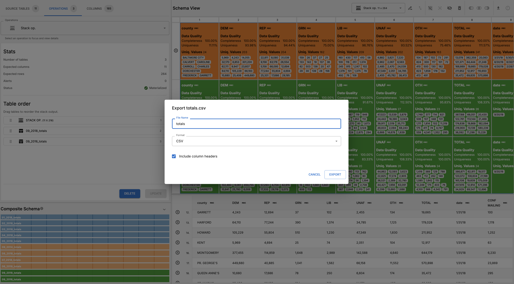

# Maryland Voter Registration Analysis

## Overview

This workflow analyzes Maryland voter registration data across multiple elections to identify registration trends, patterns of voter movement between counties, and demographic shifts in voter registration over time. The analysis provided information for the October 15, 2018, _Baltimore Sun_ story titled ["Maryland nears record high voter registration — and independents make up the fastest-growing group"](http://www.baltimoresun.com/news/maryland/politics/bs-md-2018-voter-registration-20181011-story.html) (print headline: "Parties losing Md. voters").

## Author & Source

- **Author:** Christine Zhang
- **Publication:** Baltimore Sun
- **Published:** October 15, 2018
- **Original Article URL:** http://www.baltimoresun.com/news/maryland/politics/bs-md-2018-voter-registration-20181011-story.html
- **GitHub Repository:** https://github.com/baltimore-sun-data/2018-voter-registration

## Data Sources

Data was extracted from the January through September 2018 PDF reports (September 2018 was the most recent data available at the time of publication), and from the September 2014 and September 2016 reports (for a point-in-time comparison of 2018 with the most recent election years), using [Tabula](https://tabula.technology/), an open-source tool "for liberating data tables trapped inside PDF files."

## Workflow Steps

### Pre-Processing

There is no pre-processing required to reproduce this workflow in Roundup. The CSV files generated from `01_processing.ipynb` can be directly imported into Roundup. The CSV files are located in the `input` directory. Each CSV file is named according to its category, i.e. `{month}__{year}_{category}.csv`.

### Roundup steps

_For each category, `totals`, `changes`, `new`, and `removals`; perform these steps_

1. Import CSV files for a specific category into Roundup. You can use the browser's search feature to filter by the four categories.

2. Select five tables and _stack_ them together.

3. Inspect the stack table to ensure that the data has been combined correctly.

4. Materialize the stack table and inspect the results.

5. Repeat steps 2-4 until all files have been added.

6. Inspect final stack operation schema

7. Convert the root _stack_ table's column names to lowercase (optional)

8. Export the root _stack_ table as a CSV file.

### Post Roundup steps

Once the user has integrated these tables. We expect them to perform the following data cleaning steps in a downstream tool:

- Convert numeric columns to integers: `ADDRESS`, `NAME`, `DEM`, `REP`, `GRN`, `LIB`, `OTH`, `TOTAL`, `CONF.MAILING`, `INACTIVE`.
- Derive percentage columns for each party affiliation: `DEM_PCT`, `REP_PCT`, `GRN_PCT`, `LIB_PCT`, `OTH_PCT`. These can be calculated by dividing the count of each party affiliation by the total number of voters in that row, and multiplying by 100 to get a percentage. For example, `DEM_PCT` can be calculated as `(DEM / TOTAL) * 100`.
