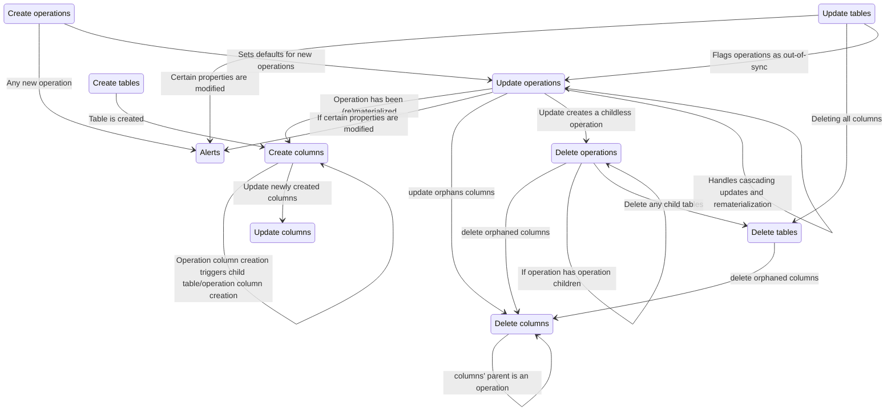

# Sagas

## Structure of sagas

Each saga typically consists of three main files:

- `watcher.js`: Listens for specific Redux actions and triggers the corresponding worker saga.
- `worker.js`: Contains the logic to perform the side effects, such as database operations and state updates.
- `actions.js`: Defines Redux action creators used to initiate saga processes.

We also include a `README.md` file in each saga directory to document its purpose, actions, payload structures, downstream effects, and relationships with other sagas.

Our `watcher.js` files do more than just watch for actions; they also handle complex orchestration logic. This includes responding to actions from other sagas, managing cascading updates, and ensuring that related data objects remain consistent across the application state. This ensure that the `worker.js` files can focus solely on their core responsibilities of updating the database and state without being burdened by orchestration logic.

## Relationship between sagas

Sagas orchestrate complex workflows in Roundup, managing side effects, interacting with databases, and ensuring state consistency across Redux slices. They listen for specific actions and trigger worker sagas to perform three tasks: creation, update, deletion, on three different data objects: tables, columns, and operations such as updating tables, columns, and operations.

