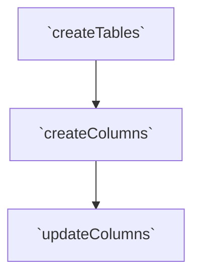

### Creating tables

Trigger chain for `createTablesSaga`, this happens when a user uploads
a new file to Roundup/

\*`updateTablesSaga` behaves differently whether or it is called via a `createColumnSuccess` event or a `createTablesSuccess`. The latest only updates the `columnIds` property of the table, which provides the up-to-date mapping between tables and columns.

Sagas also address the added complexity of denormalizing the Redux state, coordinating updates across slices. Roundup frequently needs to inverse lookup, e.g. get all columns from this table. So that these computations are $O(1)$ and not $O(n)$ where $n$ equals the number of columns across all tables and operations. We denormalize the state and derive indexes. Sagas are where we implement logic to maintain consistency across slices since inverse lookups are performance-critical. Thus we pay an additional cost at write-time (more complex updates), but reap the benefits at read time. Thus, while Sagas have other purposes, they also serve as middleware for maintaining consistency across slices.

# Control flows

