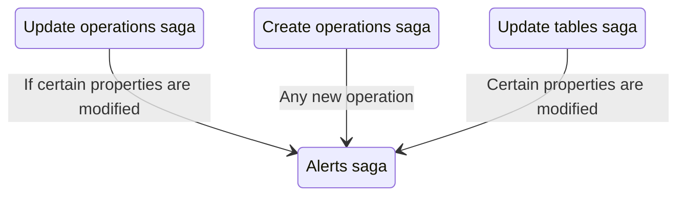

# Alerts saga

The alerts saga manages the lifecycle of validation alerts. It automatically validates operations when changes occur and manages alert state in Redux. Validation of actual alerts occurs in `watcher.js` file while the `worker.js` file is in charge of creating, deleting, and updating alerts in state. More details on what kinds of alerts Roundup checks for can be found in the `alertsSlice` directory.

## Process

## Files

| File         | Description                                     |
| ------------ | ----------------------------------------------- |
| `watcher.js` | Watches for actions and coordinates validation  |
| `worker.js`  | Processes raised alerts and updates Redux state |
| `actions.js` | Redux action creators                           |
