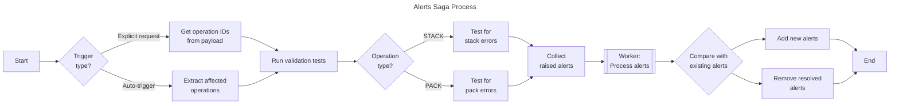

# Alerts Saga

The alerts saga manages the lifecycle of validation alerts for operations. It automatically validates operations when changes occur and manages alert state in Redux.

## Purpose

This saga detects and reports structural issues with operations, such as:

- Column misalignment in STACK operations
- Join configuration problems in PACK operations
- Missing or incompatible child relationships

## Process

## Triggers

The watcher responds to multiple action types:

| Action                           | Description                                      |
| -------------------------------- | ------------------------------------------------ |
| `checkOperationForAlertsRequest` | Explicit request to validate specific operations |
| `updateOperationsSuccess`        | Auto-validates after operation updates           |
| `updateTablesSuccess`            | Auto-validates after table column changes        |
| `createOperationsSuccess`        | Auto-validates newly created operations          |

## Actions

| Action                           | Type    | Description                           |
| -------------------------------- | ------- | ------------------------------------- |
| `updateAlertsRequest`            | Request | Triggers full alert recalculation     |
| `checkOperationForAlertsRequest` | Request | Checks specific operations for alerts |

## Files

| File         | Description                                     |
| ------------ | ----------------------------------------------- |
| `watcher.js` | Watches for actions and coordinates validation  |
| `worker.js`  | Processes raised alerts and updates Redux state |
| `actions.js` | Redux action creators                           |
