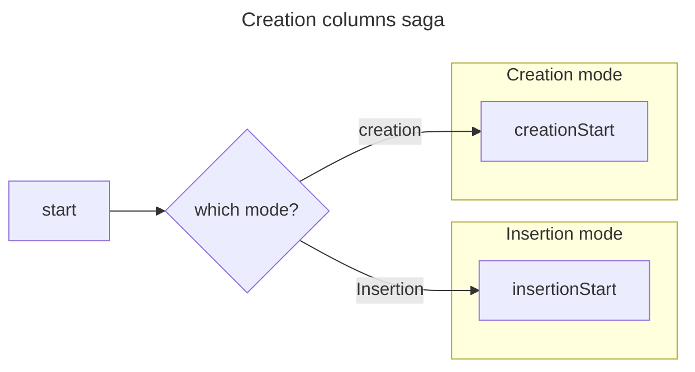

# Create Columns Saga

This saga create a column within Roundup. Its purpose is create new column metadata objects, defined in `Column.js`, and link this object to other data objects, e.g. `Table` metadata, `Operation` metadata, and columns within a table or view in the database. At this stage only these properties are populated by this saga: `id`, `parentId`, `databaseName`. Other properties are later populated in `updateColumnsSaga`.

Since Roundup denormalizes global state to optimize column lookups, this saga also updates the inverse mapping between `columns` and `tables`/`operations` specified in the `.columnIds` property of both parent object.

## Process

## Inserting columns

We consider column insertion to be a special case of column creation, as opposed to its own action. The `createColumnsSaga` handle both instantiation and insertion modes of column creation within the same saga by checking the value of a `mode` property in the action payload.

### Inserting columns into operation

Roundup implements column insertion into Operations by recursively inserting new column into the child tables and/or operations. Updates to child tables will cause a view to become out of sync and re-materialization of the view will create the appropriate new columns of an operation.
