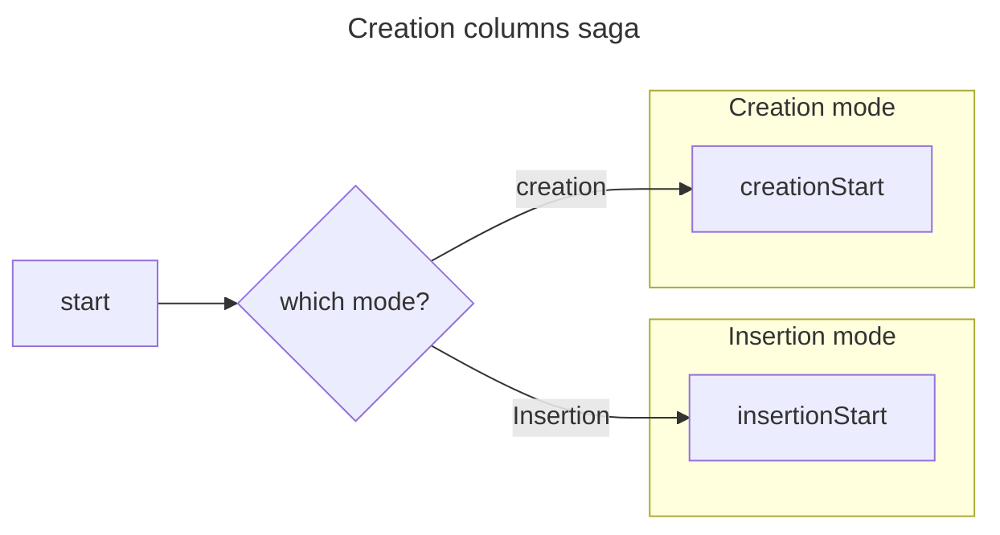

# Create Columns Saga

This saga create a column within Roundup. Its purpose is correctly link a newly created column metadata object, defined in `Column.js` other data sources, e.g. parent tables/operations defined in `Table.js` or `Operation.js`, respectively, as well as the other column within a table or view in the database. At this stage only these properties are populated by this saga: `id`, `parentId`, `databaseName`. Other properties are later populated in `updateColumnsSaga`.

Since Roundup denormalizes global state to optimize column lookups, this saga also updates the inverse mapping between `columns` and `tables`/`operations` specified in the `.columnIds` property of both parent object.

## Process

## Inserting columns

Roundup supports inserting new columns into existing database tables/views and this functionality is handled as a special case of `createColumnsSaga`. Column creation requests payloads where `mode` equals `CREATION_MODE_INSERTION`.
