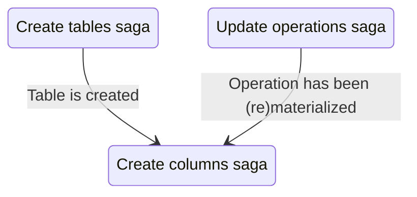

# Create Columns Saga

This saga creates a column within Roundup. Its purpose is create new column metadata objects, defined in `Column.js`, and creates columns in the database (if applicable). This saga does not populate all properties of a column, only those that are known at creation time. See `updateColumnsSaga` for more details on populating column properties.

## Relationship to other sagas

## Inserting columns

Roundup supports column creation (via Table creation) as well as column insertion into pre-existing tables. Since these higher-level actions both involve the same lower-level action of creating columns, we handle both cases within the same saga, but use different actions and differ watchers handlers to distinguish between them.

### Inserting columns into operation

Roundup implements column insertion into Operations by recursively inserting new column into the child tables and/or operations within the watcher. Hence the worker recieves a payload of all the columns including child tables and/or operations.
