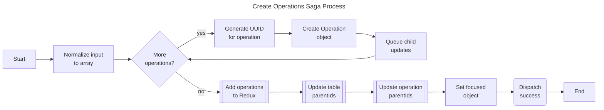

# Create Operations Saga

The create operations saga handles the creation of operation metadata objects and establishes parent-child relationships with tables and other operations.

## Purpose

This saga:

- Creates new operation objects with unique IDs and database names
- Establishes parent-child relationships between operations and their children
- Updates child tables/operations to reference their new parent
- Sets the UI focus to the newly created operation

## Supported Operation Types

| Type    | Description                                               |
| ------- | --------------------------------------------------------- |
| `PACK`  | Joins columns from multiple child tables horizontally     |
| `STACK` | Stacks rows from multiple child tables vertically (union) |
| `NO_OP` | Placeholder operation with no database view               |

## Process



## Actions

| Action                    | Type    | Description                                    |
| ------------------------- | ------- | ---------------------------------------------- |
| `createOperationsRequest` | Request | Initiates operation creation                   |
| `createOperationsSuccess` | Success | Signals successful creation with operation IDs |
| `createOperationsFailure` | Failure | Signals creation failure                       |

## Payload Structure

```javascript
{
  operationData: [
    {
      operationType: 'PACK' | 'STACK' | 'NO_OP',
      childIds: ['t_1', 't_2', 'o_1', ...]
    }
  ]
}
```

## Files

| File         | Description                                  |
| ------------ | -------------------------------------------- |
| `watcher.js` | Watches for creation requests                |
| `worker.js`  | Creates operations and updates relationships |
| `actions.js` | Redux action creators                        |
