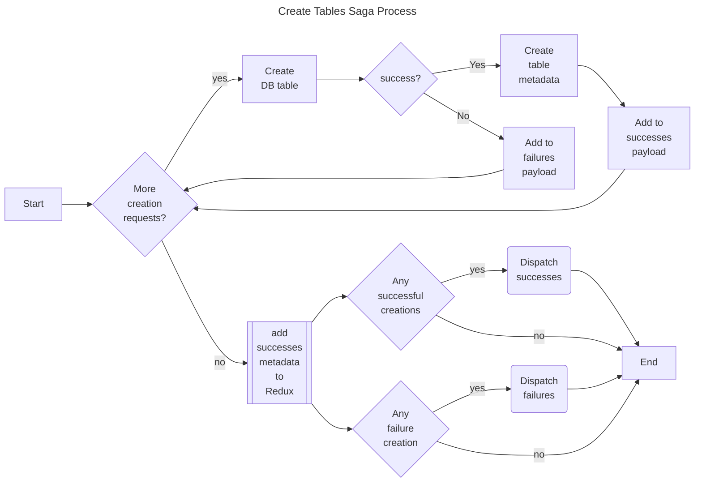

# Create Tables Saga

The create tables saga is responsible for handling the creation of table metadata objects, defined in `Tables.js`, and tables in the local database.

## Process

```mermaid
---
title: Create Tables Saga Process
---
flowchart LR
    A[Start] --> B{More<br>creation<br>requests?}
    B -->|yes| C[Create <br> DB table]
        C --> D{success?}
        D -->|Yes| E[Create<br>table<br>metadata]
        E --> G[Add to<br>successes<br>payload]
        G --> B
        D -->|No| Z[Add to<br>failures<br>payload]
        Z --> B
    B --> |no| F[[add<br>successes<br>metadata<br>to<br>Redux]]
        F --> R{Any<br>successful<br>creations}
            R -->|yes| I(Dispatch<br>successes)
                I --> End
            R -->|no| End
        F --> S{Any<br>failure<br>creation}
            S -->|yes| J(Dispatch<br>failures)
                J --> End
            S -->|no| End
```
