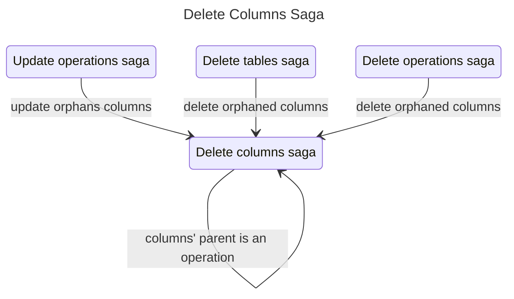

# Delete Columns Saga

The delete columns saga handles the removal of columns from both DuckDB tables and Redux state. It supports recursive deletion for _stack_ and _pack_ operation columns by propagating deletions to child tables. Deletion of a column in Roundup specifically means:

- Drops columns from DuckDB tables using `ALTER TABLE`
- Removes column metadata from Redux state

## Relationship to other sagas

## Recursive deletion of operation columns

Operation columns are derived from table columns. Deletion of operation column implies the deletion of child table columns. Opeation columns are derived differently depending on whether the operation is a _stack_ or a _pack_ operation:

- _Pack_ operations
  - Operation column at index `i` maps to left table column if `i < leftTableColumnCount`
  - Otherwise maps to right table column at `i - leftTableColumnCount`
- _Stack_ operations
  - Column at index `i` maps to column at same index in all child tables

## Files

| File         | Description                                          |
| ------------ | ---------------------------------------------------- |
| `watcher.js` | Watches for requests and handles recursive expansion |
| `worker.js`  | Executes database and state deletions                |
| `actions.js` | Redux action creators                                |
