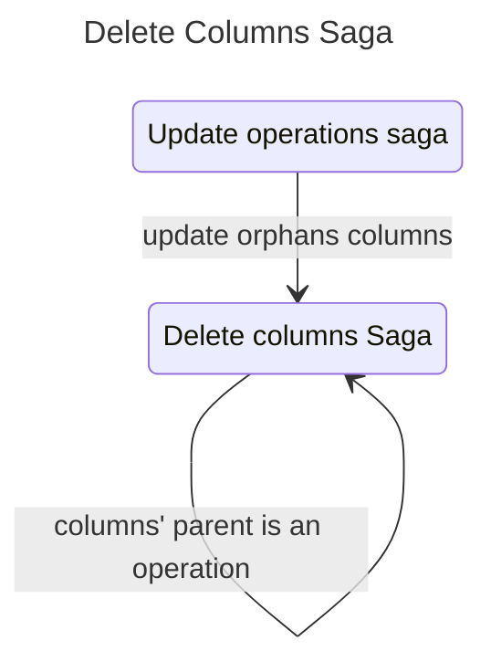

# Delete Columns Saga

The delete columns saga handles the removal of columns from both DuckDB tables and Redux state. It supports recursive deletion for _stack_ and _pack_ operation columns by propagating deletions to child tables. Deletion of a column in Roundup specifically means:

- Drops columns from DuckDB tables using `ALTER TABLE`
- Removes column metadata from Redux state

## Relationship to other sagas



## Recursive Deletion

When deleting columns from an operation:

### PACK Operations

- Column at index `i` maps to left table column if `i < leftTableColumnCount`
- Otherwise maps to right table column at `i - leftTableColumnCount`

### STACK Operations

- Column at index `i` maps to column at same index in all child tables

## Actions

| Action                 | Type    | Description                 |
| ---------------------- | ------- | --------------------------- |
| `deleteColumnsRequest` | Request | Initiates column deletion   |
| `deleteColumnsSuccess` | Success | Signals successful deletion |
| `deleteColumnsFailure` | Failure | Signals deletion failure    |

## Payload Structure

```javascript
{
  columnIds: ['col_1', 'col_2', ...]
}
```

## Files

| File         | Description                                          |
| ------------ | ---------------------------------------------------- |
| `watcher.js` | Watches for requests and handles recursive expansion |
| `worker.js`  | Executes database and state deletions                |
| `actions.js` | Redux action creators                                |
