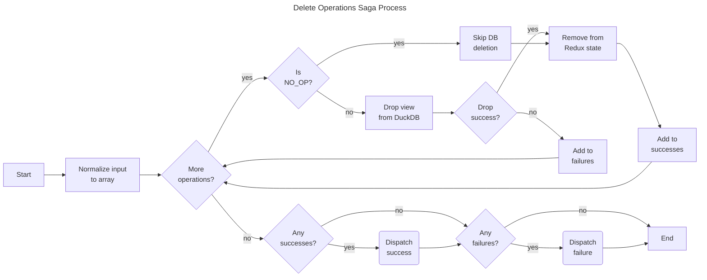
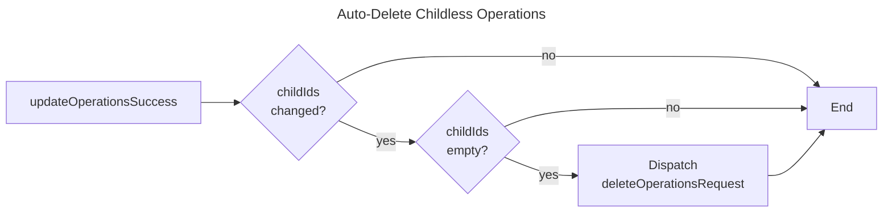

# Delete Operations Saga

The delete operations saga handles the removal of operations and their corresponding database views from DuckDB and Redux state.

## Purpose

This saga:

- Drops database views for PACK and STACK operations
- Removes operation metadata from Redux state
- Handles NO_OP operations (state-only deletion)
- Auto-deletes operations that become childless

## Process



## Auto-Deletion Trigger

The watcher listens for `updateOperationsSuccess` actions. If an operation's `childIds` property is updated to an empty array, the operation is automatically deleted.



## Actions

| Action                    | Type    | Description                  |
| ------------------------- | ------- | ---------------------------- |
| `deleteOperationsRequest` | Request | Initiates operation deletion |
| `deleteOperationsSuccess` | Success | Signals successful deletion  |
| `deleteOperationsFailure` | Failure | Signals deletion failure     |

## Payload Structure

```javascript
{
  operationIds: ['o_1', 'o_2', ...]
}
```

## Files

| File         | Description                                   |
| ------------ | --------------------------------------------- |
| `watcher.js` | Watches for requests and auto-delete triggers |
| `worker.js`  | Executes database and state deletions         |
| `actions.js` | Redux action creators                         |
