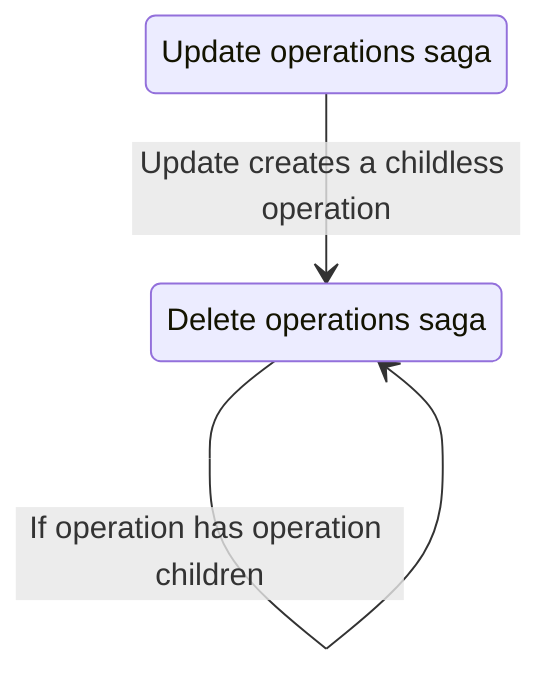

# Delete Operations Saga

The delete operations saga handles the removal of _stack_ and _pack_ operations and their corresponding database views from DuckDB and Redux state.

## Purpose

- Drops database views for PACK and STACK operations
- Removes operation metadata from Redux state
- Handles NO_OP operations (state-only deletion)
- Auto-deletes operations that become childless, e.g. if the user deletes the last table in an operation then also delete the operation (edge case).

## Relationship to other sagas

## Files

| File         | Description                                   |
| ------------ | --------------------------------------------- |
| `watcher.js` | Watches for requests and auto-delete triggers |
| `worker.js`  | Executes database and state deletions         |
| `actions.js` | Redux action creators                         |
