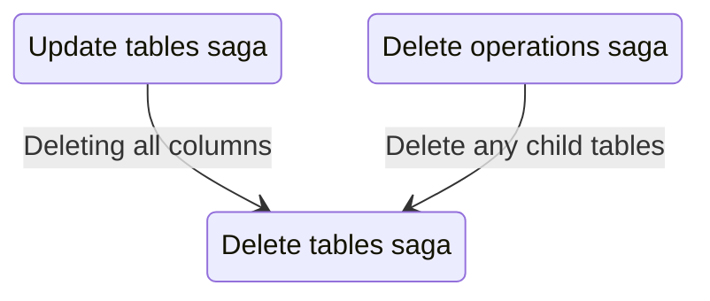

# Delete tables saga

The delete tables saga handles the removal of tables and their columns from DuckDB and Redux state.

## Purpose

This saga:

- Drops tables from DuckDB using `DROP TABLE`
- Removes table metadata from Redux state
- Removes associated column metadata (bypassing column saga)
- Auto-deletes tables that lose all their columns

## Architectural Note

Due to a DuckDB limitation, you cannot delete all columns from a table via `ALTER TABLE DROP COLUMN`. Therefore, when a table needs to be deleted, this saga handles the column cleanup directly rather than delegating to `deleteColumnsSaga`.

## Relationship with other sagas

## Files

| File         | Description                                   |
| ------------ | --------------------------------------------- |
| `watcher.js` | Watches for requests and auto-delete triggers |
| `worker.js`  | Executes database and state deletions         |
| `actions.js` | Redux action creators                         |
