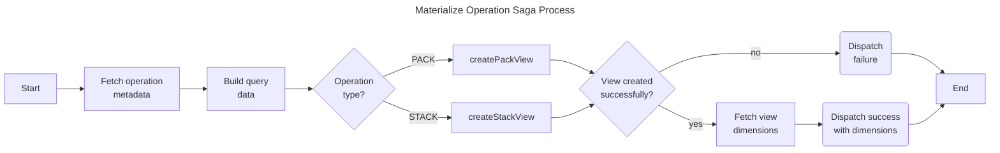

# Materialize Operation Saga

The materialize operation saga creates DuckDB views for PACK and STACK operations, syncing the database view state with operation configuration.

## Purpose

This saga:

- Creates PACK views (column joins using SQL JOIN)
- Creates STACK views (row unions using SQL UNION ALL)
- Fetches view dimensions after creation
- Reports success with dimensions or failure with error

## Process



## View Types

### PACK View

Creates a SQL `JOIN` view combining columns from child tables based on join configuration:

- Join type (INNER, LEFT, RIGHT, FULL OUTER)
- Join predicate (ON clause conditions)

### STACK View

Creates a SQL `UNION ALL` view stacking rows from child tables:

- Uses first child table as column template
- Requires compatible column structure across children

## Actions

| Action                        | Type    | Description                                 |
| ----------------------------- | ------- | ------------------------------------------- |
| `materializeOperationRequest` | Request | Initiates view creation                     |
| `materializeOperationSuccess` | Success | Signals successful creation with dimensions |
| `materializeOperationFailure` | Failure | Signals creation failure with error         |

## Payload Structure

### Request

```javascript
{
  operationId: "o_1";
}
```

### Success Response

```javascript
{
  operationId: 'o_1',
  dimensions: {
    rowCount: 1000,
    columnCount: 5
  }
}
```

## Files

| File         | Description                                   |
| ------------ | --------------------------------------------- |
| `watcher.js` | Watches for materialization requests          |
| `worker.js`  | Creates database views and fetches dimensions |
| `actions.js` | Redux action creators                         |
