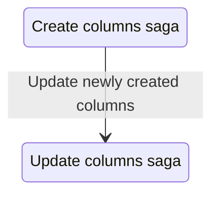

# Update Columns saga

The update columns saga is responsible for handling the updating of column properties in response to various actions within the application. It listens for specific actions and triggers the appropriate worker saga to perform the updates. Column properties that can be updated include attributes derived from database queries, such as summary statistics and top values, as well as user-defined properties, e.g. name.

This saga updates column metadata in state by mutating the object inplace, rather than replacing it entirely. This approach helps to preserve references to the column object held elsewhere in the state tree. We know inplace mutation is safe here because Redux Toolkit uses Immer under the hood, which tracks changes and produces a new immutable state.

## Relationship to other sagas

