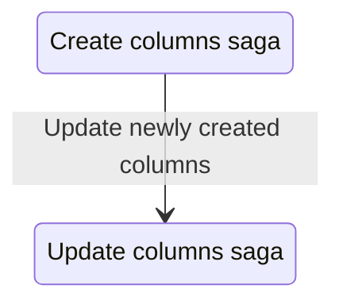

# Update Columns saga

The update columns saga is responsible for handling the updating of column properties in response to various actions within the application. It listens for specific actions and triggers the appropriate worker saga to perform the updates. Column properties that can be updated include attributes derived from database queries, such as summary statistics and top values, as well as user-defined properties, e.g. name.

## Relationship to other sagas

