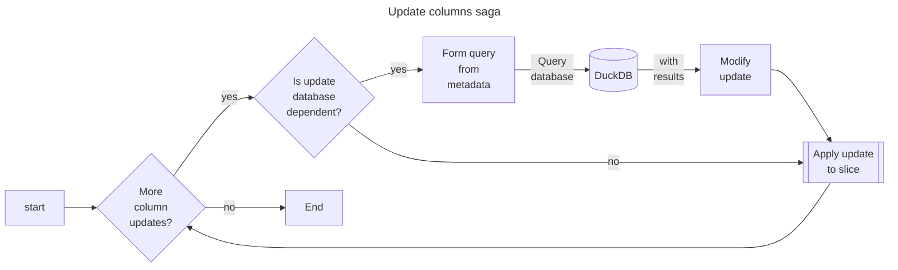

# Update Columns saga

```mermaid
---
title: Update columns saga
---
flowchart LR
    start --> A{More<br>column<br>updates?}
    A -->|yes| B{Is update<br>database<br> dependent?}
    B -->|yes| C[Form query<br>from<br> metadata]
    C -->|Query<br>database|DB[(DuckDB)]
    DB -->|with<br>results| D[Modify<br>update]
    D --> E
    B -->|no| E[[Apply update<br> to slice]]
    E --> A
    A -->|no| End
```
