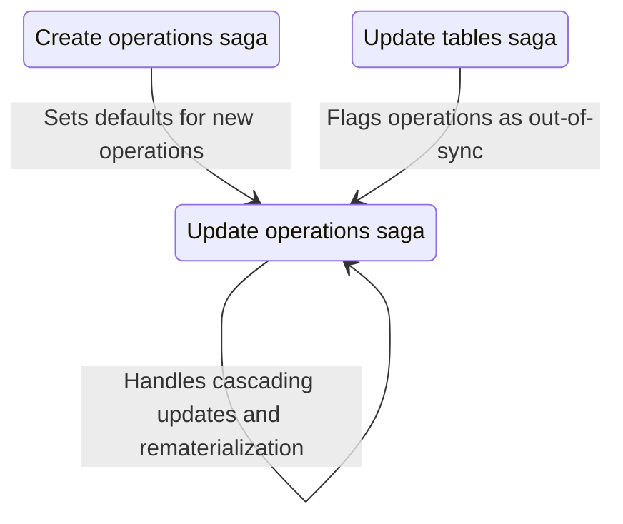

# Update Operations Saga

The update operations saga syncs database views with Redux store state and manages operation property updates. It handles post-creation setup and coordinates parent-child relationships.

## Purpose

This saga:

- Updates operation properties in Redux state
- Recreates PACK/STACK views when configuration changes
- Manages parent-child relationship synchronization
- Calculates match statistics for PACK operations
- Handles loading states during long-running operations

## Reltaionship to other sagas

## Files

| File         | Description                              |
| ------------ | ---------------------------------------- |
| `watcher.js` | Watches for updates and cascade triggers |
| `worker.js`  | Executes updates and recreates views     |
| `actions.js` | Redux action creators                    |
