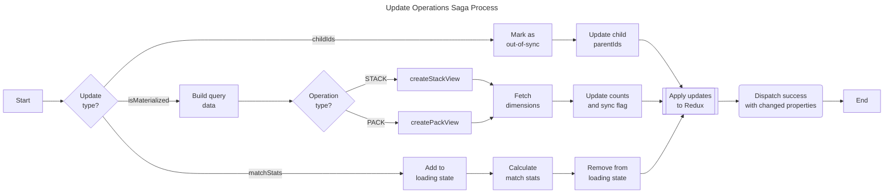

# Update Operations Saga

The update operations saga syncs database views with Redux store state and manages operation property updates. It handles post-creation setup and coordinates parent-child relationships.

## Purpose

This saga:

- Updates operation properties in Redux state
- Recreates PACK/STACK views when configuration changes
- Manages parent-child relationship synchronization
- Calculates match statistics for PACK operations
- Handles loading states during long-running operations

## Process



## Triggers

The watcher responds to multiple action types:

| Action                    | Description                                               |
| ------------------------- | --------------------------------------------------------- |
| `updateOperationsRequest` | Explicit update request                                   |
| `createOperationsSuccess` | Sets defaults for new operations                          |
| `updateTablesSuccess`     | Flags operations as out-of-sync when child columns change |
| `updateOperationsSuccess` | Handles cascading updates and rematerialization           |

## Post-Creation Setup

When operations are created, this saga automatically:

1. Sets `columnCount` to null (triggers calculation)
2. For PACK operations: sets default `joinType` and `joinPredicate`

## Out-of-Sync Detection

Operations are marked `isInSync: false` when:

- `childIds` property changes
- `operationType` property changes
- `joinType` property changes (PACK only)
- `joinPredicate` property changes (PACK only)

## Actions

| Action                    | Type    | Description                                        |
| ------------------------- | ------- | -------------------------------------------------- |
| `updateOperationsRequest` | Request | Initiates operation updates                        |
| `updateOperationsSuccess` | Success | Signals successful updates with changed properties |
| `updateOperationsFailure` | Failure | Signals update failure                             |

## Payload Structure

### Request

```javascript
{
  operationUpdates: [
    { id: "o_1", childIds: ["t_1", "t_2"] },
    { id: "o_2", isMaterialized: true },
  ];
}
```

### Success Response

```javascript
{
  changedPropertiesById: {
    'o_1': ['childIds', 'isInSync'],
    'o_2': ['isMaterialized', 'rowCount', 'columnCount']
  }
}
```

## Files

| File         | Description                              |
| ------------ | ---------------------------------------- |
| `watcher.js` | Watches for updates and cascade triggers |
| `worker.js`  | Executes updates and recreates views     |
| `actions.js` | Redux action creators                    |
