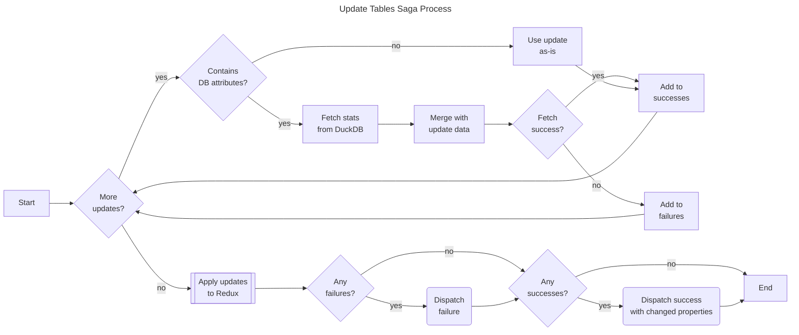

# Update Tables Saga

The update tables saga handles table property updates, including fetching statistics from DuckDB when database-derived attributes need refreshing.

## Purpose

This saga:

- Updates table properties in Redux state
- Fetches table statistics (rowCount, columnIds) from DuckDB when needed
- Tracks which properties changed for downstream sagas
- Handles update failures gracefully

## Process



## Database Attributes

When an update includes any of these properties, the saga fetches fresh statistics from DuckDB:

| Attribute   | Description                      |
| ----------- | -------------------------------- |
| `rowCount`  | Number of rows in the table      |
| `columnIds` | Array of column IDs in the table |

Setting these properties to `null` in an update request triggers a database refresh.

## Actions

| Action                | Type    | Description                                        |
| --------------------- | ------- | -------------------------------------------------- |
| `updateTablesRequest` | Request | Initiates table updates                            |
| `updateTablesSuccess` | Success | Signals successful updates with changed properties |
| `updateTablesFailure` | Failure | Signals update failure                             |

## Payload Structure

### Request

```javascript
{
  tableUpdates: [
    { id: "t_1", rowCount: null }, // Triggers DB fetch
    { id: "t_2", name: "New Name" }, // State-only update
  ];
}
```

### Success Response

```javascript
{
  changedPropertiesById: {
    't_1': ['rowCount'],
    't_2': ['name']
  }
}
```

## Downstream Effects

The `updateTablesSuccess` action triggers several downstream processes:

| Saga                   | Trigger Condition                               |
| ---------------------- | ----------------------------------------------- |
| `deleteTablesSaga`     | `columnIds` becomes empty array                 |
| `alertsSaga`           | Column changes affecting parent operations      |
| `updateOperationsSaga` | Child table changes requiring rematerialization |

## Files

| File         | Description                           |
| ------------ | ------------------------------------- |
| `watcher.js` | Watches for update requests           |
| `worker.js`  | Executes updates and fetches DB stats |
| `actions.js` | Redux action creators                 |
